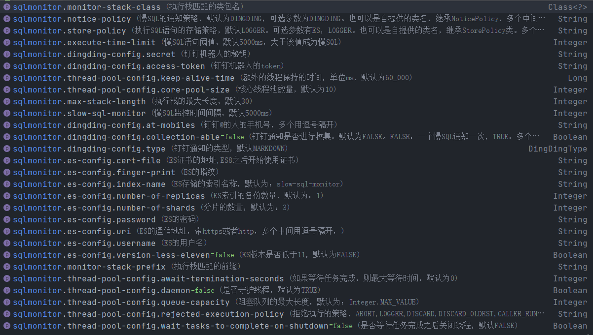

# sqlmonitor-spring-boot

SQLMonitor-spring-boot-start用于将sqlMonitor-mybatis插件自动集成到Spring boot中，从而不用用户自己在Mybatis的配置文件中设置该插件。

主要是基于[sqlMonitor-mybatis](https://github.com/1997chang/sqlmonitor)提供的功能，自动注册sqlMonitor插件，从而完成SQL语句的监控，通知，存储等功能。快速定位慢SQL语句有哪个Mapper的哪个方法造成。

Sql Monitor in Spring Boot Project

## 如何使用

### 1. 添加依赖
```xml
<dependency>
    <artifactId>sqlmonitor-spring-boot</artifactId>
    <groupId>io.github.1997chang</groupId>
    <version>1.0.0</version>
</dependency>
```

注意：当使用钉钉进行通知的时候：如何配置钉钉机器人的配置信息依赖，还要添加okhttp3依赖，版本要求4.1.0以上
```xml
<!-- https://mvnrepository.com/artifact/com.squareup.okhttp3/okhttp -->
<dependency>
    <groupId>com.squareup.okhttp3</groupId>
    <artifactId>okhttp</artifactId>
    <version>4.9.3</version>
</dependency>

```

### 2. 设置Mybatis插件参数

使用spring boot的参数自动提示功能，前缀字符串为`sqlmonitor`。如下图：


例子：
```
sqlmonitor.dingding-config.access-token=10f12cead3ce688dc030a35ad584f90aed07af401bd918b652c99a2180e77f2b
sqlmonitor.dingding-config.secret=SECd115fa66c6782b3e6bd361a73ee9a66bd53bb3697466cbb6457c27e335799f1a
sqlmonitor.execute-time-limit=2000
sqlmonitor.monitor-stack-class=com.wx.app.ygp.YgpApplication
```